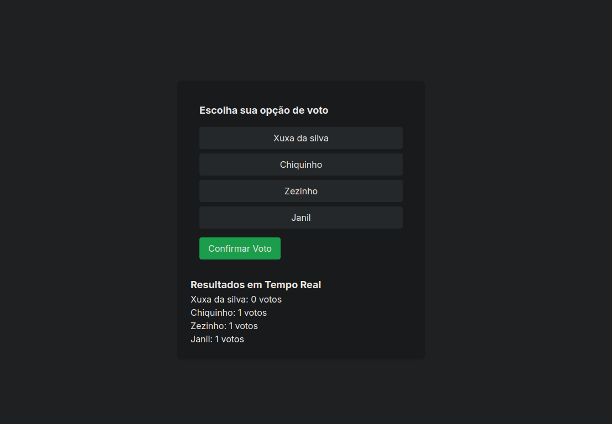

<p align="center">
<a href=https://github.com/ThiLourenco/e-commerce target="_blank">

</a>
</p>


*Este readme também pode ser lido em [Português](README-pt-BR.md) ou [Inglês](README.md).*

## 📌 Projeto

Aplicação de votos em tempo real.


## 🔍 Índice

* [💻 Tecnologias](#Tecnologias)

* [📝 Resumo do Projeto](#project-summary)

* [⚙️ Configurando](#setting-up)

* [🚀 Execute localmente](#run-locally)

* [📄 Licença](#license)

## 💻 Tecnologias

Este projeto faz uso de uma pilha de tecnologia moderna e essencial, incluindo:

- [typescript](https://www.typescriptlang.org/): Um superconjunto de ferramentas e formas mais eficientes de escrever código JavaScript.
- [zod](https://github.com/colinhacks/zod): Biblioteca de validação de esquema TypeScript-first..
- [next](https://nextjs.org/): Framework para aplicações React renderizados em servidor.
- [react](https://reactjs.org/): Biblioteca JavaScript para construção de interfaces de usuário.
- [react-dom](https://reactjs.org/docs/react-dom.html): Ponto de entrada para o DOM e renderizadores de servidor para React.
- [tailwindcss](https://tailwindcss.com/): Um framework CSS utilitário que acelera o desenvolvimento de interfaces de usuário com estilos consistentes.
- [prisma/client](https://www.prisma.io/docs/reference/tools-and-interfaces/prisma-client): Cliente Prisma para acesso a banco de dados e ORM.


## ⚙️ Configuração

*.env.example*

```bash
# environment
NEXT_PUBLIC_POLLID="" # id da enquete criada
SERVER="http://localhost:3333/polls"
```

## Criar nova enquete
```bash

POST http://localhost:3333/polls
body:
{
	"title": "Votação 2024",
	"options": ["Xuxa da silva", "Chiquinho", "Zezinho", "Janil"]
}
```

## 📄 Licença

Este projeto está licenciado sob o **MIT License** - veja o arquivo [**MIT License**](https://github.com/ThiLourenco/votes-app/blob/main/LICENSE) para mais detalhes.

