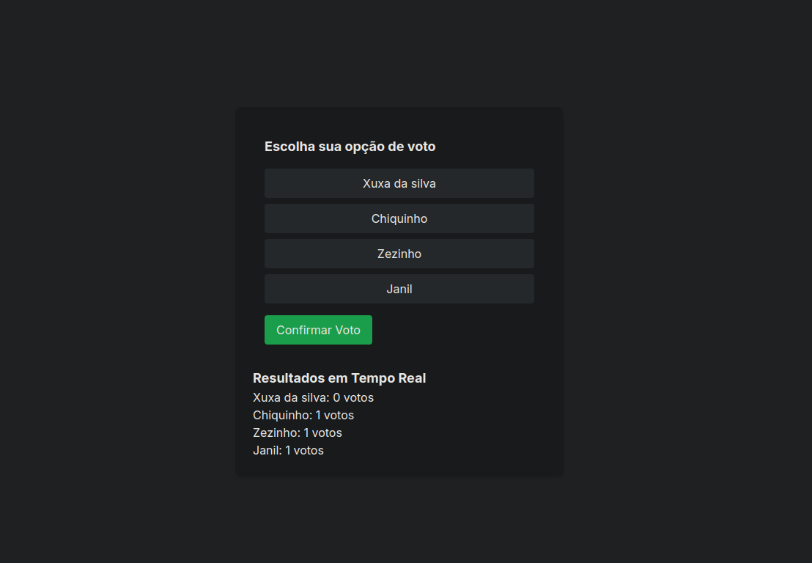

<p align="center">
<a href=https://github.com/ThiLourenco/e-commerce target="_blank">

</a>
</p>

*This readme can also be read in [Brazilian Portuguese](README-pt-BR.md) or [English](README.md).*

## 📌 Project

Votes application in realtime.

## 🔍 Table of Contents

* [💻 Stack](#stack)

* [📝 Project Summary](#project-summary)

* [⚙️ Setting Up](#setting-up)

* [🚀 Run Locally](#run-locally)

* [📄 License](#license)

## 💻 Stack

This project makes use of a modern and essential technology stack, including:


- [typescript](https://www.typescriptlang.org/): A typed superset of JavaScript that compiles to plain JavaScript.
- [zod](https://github.com/colinhacks/zod): TypeScript-first schema validation library.

- [next](https://nextjs.org/): Framework for server-rendered React applications.
- [react](https://reactjs.org/): JavaScript library for building user interfaces.
- [react-dom](https://reactjs.org/docs/react-dom.html): Entry point to the DOM and server renderers for React.
- [tailwindcss](https://tailwindcss.com/): A utility CSS framework that accelerates the development of user interfaces with consistent styles.
- [prisma/client](https://www.prisma.io/docs/reference/tools-and-interfaces/prisma-client): Prisma client for database access and ORM.

## ⚙️ Setting Up

*.env.example*

```bash
# environment
NEXT_PUBLIC_POLLID=""
SERVER="http://localhost:3333/polls"
```

## Create new poll
```bash

POST http://localhost:3333/polls
body:
{
	"title": "Votação 2024",
	"options": ["Xuxa da silva", "Chiquinho", "Zezinho", "Janil"]
}
```

## 🚀 Run Locally

You must have the following installed on your machine to run this project:

- [Node.js](https://nodejs.org/en/): Version >= 20
- Package Manager: ([Npm](https://www.npmjs.com/) or [pNPM](https://pnpm.io/pt/)) or others...


1.Clone the e-commerce repository:
```sh
git clone https://github.com/ThiLourenco/app-votes
```
2.Install the dependencies with one of the package managers listed below:
```bash
pnpm install
npm install

```
3.Start the development mode:
```bash
pnpm dev
npm run dev

```


## 📄 License

This project is licensed under the **MIT License** - see the [**MIT License**](https://github.com/ThiLourenco/app-votes/blob/main/LICENSE) file for details.

